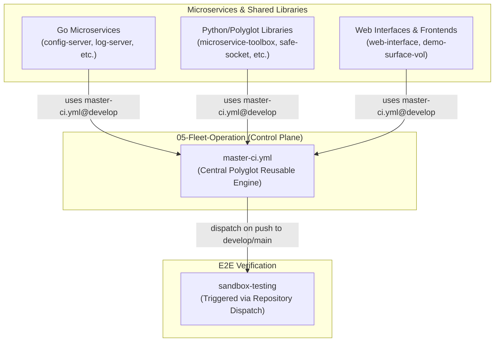

# 🚀 Ecosystem CI/CD Strategy & Long-Term Workflow Architecture

This document defines the ecosystem-level Continuous Integration and Continuous Deployment (CI/CD) architecture across all microservices, shared libraries, and vaults in the `Bastien-Antigravity` ecosystem.

---

## 🏛️ 1. Architectural Principles

### Key Ecosystem Rules:
1. **Single Source of Truth (`master-ci.yml`)**:
   Individual microservices and libraries DO NOT maintain separate 200-line CI pipelines. Each repository maintains a lightweight 12-line `.github/workflows/ci.yml` wrapper calling `master-ci.yml@develop` from `05-Fleet-Operation`.
2. **Dynamic Polyglot Matrix**:
   `master-ci.yml` dynamically inspects the repository file tree on every run to detect languages:
   - **Go**: `go.mod` $\rightarrow$ `go test ./...`
   - **Python**: `requirements.txt` / `setup.py` / `pyproject.toml` $\rightarrow$ `pytest`
   - **Rust**: `Cargo.toml` $\rightarrow$ `cargo test`
   - **C++**: `Makefile` / `CMakeLists.txt` $\rightarrow$ `make test`
   - **Node.js / JS**: `package.json` $\rightarrow$ `npm test`
3. **Private Dependency Protection**:
   `GOPRIVATE="github.com/Bastien-Antigravity/*"` is enforced centrally to prevent Go toolchains from querying public checksum databases for private ecosystem packages.
4. **Sandbox Integration Dispatch**:
   Upon successful execution on `develop` or `main`, `master-ci.yml` dispatches a `fleet-event` trigger to `sandbox-testing` for multi-service integration verification.

---

## 📦 2. Workflow Catalog

| Workflow File | Repository Role | Trigger | Description |
| :--- | :--- | :--- | :--- |
| `.github/workflows/ci.yml` | All Repositories | `push` (develop, main), `pull_request` | Wrapper delegating to central `master-ci.yml@develop` |
| `.github/workflows/release.yml` | Shared Polyglot Libraries | `push` (tags: `v*`) | Compiles multi-OS binaries (Linux/macOS/Windows) and PyPI wheels for GitHub Releases |
| `05-Fleet-Operation/.github/workflows/master-ci.yml` | `05-Fleet-Operation` | Reusable (`workflow_call`) | Central polyglot matrix engine |

---

## 🛡️ 3. Long-Term Maintenance & Reliability

To ensure zero-drift over long-term operations:
- **Dependency Caching**: `setup-go`, `setup-python`, and `setup-node` utilize native GitHub Actions caching (`cache: true` / `cache: 'npm'`).
- **Graceful Fallbacks**: Test steps use multi-path fallbacks to handle single or multi-module directory structures cleanly.
- **Auditing Automation**: `08-Base-Scripts` (`fleet_commander.py`) audits workflow compliance prior to every push.
