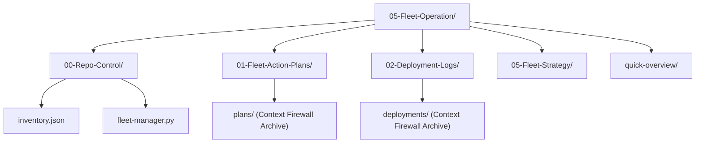

# 📡 Zone 3 (Fleet) Command Center: Architecture Overview

The `05-Fleet-Operation` vault serves as the central control plane, registry, and strategy engine for the entire Bastien-Antigravity multi-repository fleet. It enforces architectural alignment, orchestrates global operations, and maintains standardized versioning.

---

## 🏗️ Core Directory Structure

### 1. Registry & Orchestration: `00-Repo-Control/`
- **`inventory.json`**: The **Single Source of Truth** for the registry of all repositories in the Bastien-Antigravity fleet. It specifies repository names, local paths, remotes, and branch defaults.
- **`fleet-manager.py`**: Command-line tool for mass-repository administration (e.g., discover, status, branch, tag, sync, commit, etc.).

### 2. Strategic Execution: `01-Fleet-Action-Plans/`
- Holds active blueprints for mass fleet operations (e.g., standardizing CI/CD, library upgrades).
- Features a **plans/** subdirectory (Context Firewall Archive) protected by `.aiignore`, `.mcpignore`, and `.geminiignore` containing `*` to archive completed plans without bloating AI token count.

### 3. Chronological Traceability: `02-Deployment-Logs/`
- Houses post-deployment records detailing system state, commander signatures, and action metadata.
- Features a **deployments/** subdirectory (Context Firewall Archive) managed by automated `archive.py` to keep only the absolute latest active log in the root folder.

### 4. Governance & Rules: `05-Fleet-Strategy/`
- Houses fleet strategy files establishing git-flow rules, CI protocols, CD lifecycles, and standardized branch protection structures.

### 5. Compliance Overview: `quick-overview/`
- Contains standard microservice compliance files (`Architecture-Overview.md`, `Features-Behavior.md`, `General-Misc.md`, `Testing-Playbook.md`) ensuring total alignment with the ecosystem's sovereignty checks.
